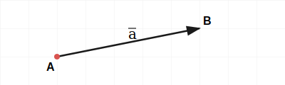
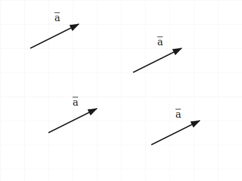

# Тема 1. Векторы: основные понятия

## 1. Определение вектора
Вектор — это направленный отрезок, то есть отрезок, для которого указано, какая точка является его началом, а какая концом (см. рис. 1). Математически вектор определяется как упорядоченная пара точек $(A, B)$ на плоскости или в пространстве.

<small>Рис. 1. Определение вектора через начало и конец</small>

- **Обозначение:** $\vec{AB}$ или одна строчная латинская буква $\vec{a}$ (рис. 1).
- **Направление:** порядок точек имеет критическое значение. Вектор $\vec{AB}$ направлен от $A$ к $B$, вектор $\vec{BA}$ считается противоположным.

## 2. Нулевой вектор
Особый вид вектора, у которого точка начала совпадает с точкой конца.

- **Символ:** $\vec{0}$.
- **Свойства:** длина нулевого вектора $|\vec{0}| = 0$; направление не определено (геометрически это точка).

## 3. Длина (модуль) вектора
Модулем (длиной) вектора называется расстояние между его начальной и конечной точками.

- **Обозначение:** $|\vec{a}|$ или $|\vec{AB}|$.
- Модуль — скалярная величина (число), всегда $\ge 0$.

## 4. Понятие свободного вектора (Free Vector)
В аналитической геометрии используется понятие **свободного вектора**: вектор задаётся только длиной и направлением (см. рис. 2).

<small>Рис. 2. Свободный вектор: перенос без изменения свойств</small>

- **Ключевое свойство:** вектор можно переносить параллельно самому себе в любую точку; все сонаправленные отрезки одинаковой длины — один и тот же свободный вектор (рис. 2).
- **Важно:** в отличие от прикладной механики (где важна точка приложения силы), здесь можно совмещать начало вектора с любой точкой, например с началом координат.

## 5. Коллинеарность и равенство
Векторы **коллинеарны**, если они параллельны одной прямой или лежат на ней.

- **Виды коллинеарности:**
  1. **Сонаправленные** ($\vec{a} \uparrow\uparrow \vec{b}$): смотрят в одну сторону.
  2. **Противоположно направленные** ($\vec{a} \uparrow\downarrow \vec{b}$): смотрят в разные стороны.
- **Условие равенства:** $\vec{a} = \vec{b}$ тогда и только тогда, когда векторы сонаправлены и имеют равную длину.
