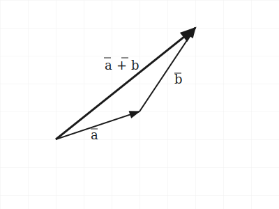
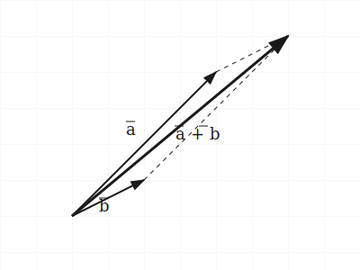
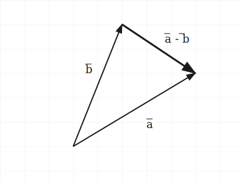

# Тема 2. Линейные операции над векторами

## 1. Сложение векторов

Суммой двух векторов $\vec{a}$ и $\vec{b}$ называется вектор, полученный по одному из двух правил.

**А. Правило треугольника (см. рис. 1)**

Второй вектор $\vec{b}$ прикладывается своим началом к концу первого $\vec{a}$. Сумма $\vec{a} + \vec{b}$ соединяет начало первого с концом второго.

<small>Рис. 1. Правило треугольника:</small> $\vec{a} + \vec{b}$

**Б. Правило параллелограмма (см. рис. 2)**

Векторы $\vec{a}$ и $\vec{b}$ прикладываются к общему началу. Сумма $\vec{a} + \vec{b}$ — диагональ параллелограмма из того же начала.

<small>Рис. 2. Правило параллелограмма:</small> $\vec{a} + \vec{b}$

_Применение: сложение двух сил, приложенных к одной точке._

## 2. Вычитание векторов

Разностью $\vec{a}$ и $\vec{b}$ называется вектор $\vec{c} = \vec{a} - \vec{b}$, для которого $\vec{b} + \vec{c} = \vec{a}$.

**Геометрическое построение (см. рис. 3):** векторы от общего начала; разность $\vec{a} - \vec{b}$ соединяет конец $\vec{b}$ с концом $\vec{a}$.

<small>Рис. 3. Вычитание векторов:</small> $\vec{a} - \vec{b}$

## 3. Умножение вектора на число (скаляр)

Произведением вектора $\vec{a}$ на число $\lambda \neq 0$ называется вектор $\vec{b} = \lambda\vec{a}$ такой, что:

1. **Длина:** $|\vec{b}| = |\lambda| \cdot |\vec{a}|$.
2. **Направление:** при $\lambda > 0$ вектор $\vec{b}$ сонаправлен с $\vec{a}$ ($\vec{b} \uparrow\uparrow \vec{a}$); при $\lambda < 0$ противоположно направлен ($\vec{b} \uparrow\downarrow \vec{a}$).

## 4. Свойства линейных операций

Для любых векторов $\vec{a}, \vec{b}, \vec{c}$ и чисел $\lambda, \mu$:

1. $\vec{a} + \vec{b} = \vec{b} + \vec{a}$ (коммутативность).
2. $(\vec{a} + \vec{b}) + \vec{c} = \vec{a} + (\vec{b} + \vec{c})$ (ассоциативность).
3. $\lambda(\vec{a} + \vec{b}) = \lambda\vec{a} + \lambda\vec{b}$ (дистрибутивность по сумме векторов).
4. $(\lambda + \mu)\vec{a} = \lambda\vec{a} + \mu\vec{a}$ (дистрибутивность по сумме чисел).

## 5. Линейная зависимость и коллинеарность

Два ненулевых вектора коллинеарны тогда и только тогда, когда один выражается через другой умножением на число:

$$\vec{b} = \lambda \vec{a}$$

Это **условие коллинеарности** в векторной форме.
